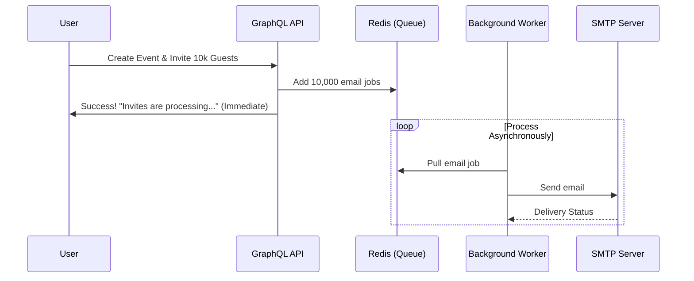
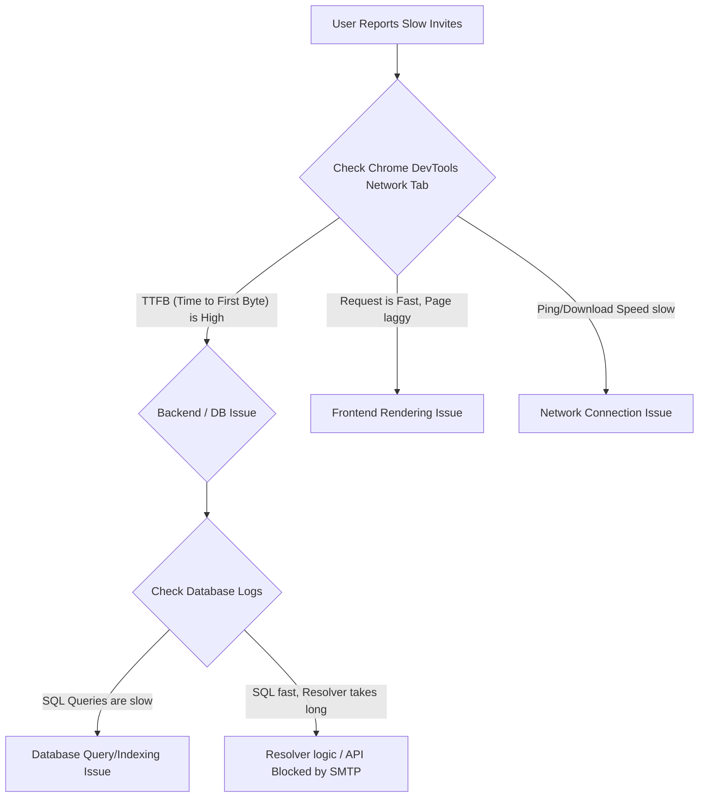

# Eventify — Interview Questions & Beginner-Friendly Answers

Welcome! This guide provides comprehensive, beginner-friendly answers to all the questions listed in [questions.md](file:///s:/Eventifyy/eventify-server/questions.md). 

These answers are structured to help you understand the core concepts from first principles, contrasting standard **industry best practices** with the **current state of the codebase**.

---

## 🏛️ Backend Tech Lead Lens

### 1. GraphQL Schema Design & N+1 Queries
> **Question**: You used GraphQL (Apollo Server 5 on Express 5) for the API layer. Walk me through your schema design — what were your core types and how did you handle N+1 queries? Did you use DataLoader?

#### 💡 Beginner-Friendly Explanation:
* **GraphQL Schema**: Unlike REST, which has multiple endpoints (like `/users` or `/events`), GraphQL has a single endpoint (usually `/graphql`). The client specifies exactly what data it wants using a query.
* **Core Types**:
  * `User`: Represents an account ([user-type.ts](file:///s:/Eventifyy/eventify-server/src/graphql/user/user-type.ts#L6)). Contains fields like `id`, `firstName`, `lastName`, `email`, `verified`, and timestamps.
  * `Event`: Represents an event ([event-type.ts](file:///s:/Eventifyy/eventify-server/src/graphql/events/event-type.ts#L6)). Contains `id`, `title`, `description`, `date`, `location`, `createdBy` (which maps to a `User` type), and `invitedEmails`.
* **The N+1 Query Problem**: Imagine you query a list of 100 events, and for each event, you want to show the name of the creator.
  1. The server runs **1 query** to fetch the 100 events: `SELECT * FROM events;`
  2. For **each** of the 100 events, the server runs a separate query to fetch the creator user: `SELECT * FROM users WHERE id = <event_creator_id>;`
  3. This results in $1 + 100 = 101$ database queries (N+1 queries). This is extremely slow and hammers your database.
* **DataLoader**: A utility library from Meta. It solves N+1 queries by **batching** and **caching**. Instead of running a database query immediately for each creator, DataLoader waits for one "tick" of the event loop, collects all 100 user IDs, and executes a single query: `SELECT * FROM users WHERE id IN (1, 2, 3, ...);`

#### 🔍 Current Codebase Reality:
* The current codebase uses Sequelize joins (`include: [{ model: User, as: "creator" }]`) inside the queries (`myEvents`, `event`, etc.) to eagerly load user details in a single database query.
* **No DataLoader is used** in this project, and it is not installed in [package.json](file:///s:/Eventifyy/eventify-server/package.json). If you were to resolve relationships dynamically using nested fields instead of Sequelize eager-loading, you would encounter N+1 issues.

---

### 2. Rate Limiting and CORS Security
> **Question**: You implemented rate limiting and CORS security. How did you differentiate rate limit states (per-IP, per-user, per-query complexity)? Did you use a library like express-rate-limit or a custom middleware?

#### 💡 Beginner-Friendly Explanation:
* **CORS (Cross-Origin Resource Sharing)**: A browser security mechanism. It prevents a malicious website (e.g., `evil-tracker.com`) from reading data from your API (`api.eventify.com`) unless your server explicitly allows it.
* **Rate Limiting**: Restricting how many requests a user or client can make in a given timeframe (e.g., 100 requests every 15 minutes) to prevent hackers from crashing your site or guessing passwords.
* **Differentiating Rate Limit States**:
  * **Per-IP**: Restricts requests based on the user's physical internet location (IP address). Prevents server overloading (DDoS) and broad spam attacks.
  * **Per-User**: Restricts requests based on a logged-in user's ID. Protects resources even if the user switches their IP (using a VPN).
  * **Per-Query Complexity**: Specific to GraphQL. Hackers can write complex nested queries (e.g., asking for an event, its creator, their events, those creators, etc., recursively) to overload the CPU. Query complexity tools measure how "expensive" a query is and block it if it exceeds a limit.

#### 🔍 Current Codebase Reality:
* **CORS**: Configured in [cors.ts](file:///s:/Eventifyy/eventify-server/src/configs/cors.ts) using the standard `cors` middleware, allowing specific domains.
* **Rate Limiting**:
  1. **Express Level**: Uses `express-rate-limit` globally inside [limiter.ts](file:///s:/Eventifyy/eventify-server/src/middlewares/limiter.ts) to restrict IPs to 100 requests per 15 minutes.
  2. **GraphQL Level**: Sets up `graphql-rate-limit-directive` in [server.ts](file:///s:/Eventifyy/eventify-server/src/server.ts#L54), which dynamically generates keys based on `userId` or `IP`. However, the `@rateLimit` directive is never declared in the schema or applied to any fields, meaning it is not actively protecting the API. Query complexity limits are not implemented.

---

### 3. Database Migration Strategy
> **Question**: Sequelize ORM with PostgreSQL — what was your migration strategy? Did you use Sequelize migrations or raw SQL? How did you handle schema changes in development vs production?

#### 💡 Beginner-Friendly Explanation:
* **ORM (Object-Relational Mapping)**: A tool (Sequelize) that lets you write JavaScript/TypeScript classes to interact with database tables instead of writing raw SQL commands (`SELECT`, `INSERT`).
* **Migrations**: Version control for databases. When you add a new column (like `avatarUrl` to a User), you write a script that runs the modification. This ensures everyone on your team—and your production server—has the exact same database structure.
* **Development vs. Production**:
  * **In Development**: You want speed. Developers often let the ORM automatically sync and create tables.
  * **In Production**: You cannot let the app automatically sync, because it might lock database tables (causing outages) or delete columns by accident (causing data loss). You must run step-by-step migration files manually or via CI/CD before launching the server code.

#### 🔍 Current Codebase Reality:
* The codebase uses `await sequelize.sync({ alter: true })` inside [sequelize-postgre.ts](file:///s:/Eventifyy/eventify-server/src/configs/sequelize-postgre.ts#L36) to automatically alter database tables when the server boots.
* There is no Sequelize migrations setup (`sequelize-cli`, CLI configs, or migration folders) or raw SQL migrations.
* *Interview Tip*: Acknowledge that while automatic syncing was used for rapid prototyping, a production setup would replace `sync({ alter: true })` with migration files managed by Sequelize migrations or `umzug`.

---

### 4. SHA-256 OTP & Email Verification
> **Question**: You used SHA-256 OTP with email verification. Why SHA-256 specifically? How did you store OTPs? What was the expiry strategy? How did you prevent OTP brute-forcing?

#### 💡 Beginner-Friendly Explanation:
* **OTP (One-Time Password)**: A temporary numeric code (e.g., `123456`) sent to verify identity.
* **Why Hash with SHA-256?**: If a hacker steals your database, they shouldn't see active verification codes. By hashing the OTP with SHA-256 and a secret salt before saving it, the database only stores a scramble (e.g., `e3b0c442...`). When the user enters their code, the server hashes it and compares the two scrambles.
* **Expiry Strategy**: An OTP should only work for a short window (e.g., 10 minutes). The database stores a timestamp `otpExpiry`. When verifying, the server checks `currentTime < otpExpiry`.
* **Brute-Forcing**: A 6-digit code has 1,000,000 possibilities. A fast script can try all of them in minutes. To prevent this, you must block verification for a user after 3 to 5 failed attempts.

#### 🔍 Current Codebase Reality:
* **Hashing**: Implemented correctly in [otp-service.ts](file:///s:/Eventifyy/eventify-server/src/utils/otp-service.ts) using `CryptoJS.SHA256` and a salt (`OTP_SECRET`).
* **Expiry**: Stored as `otpExpiry` set to 10 minutes in the database.
* **Brute-Forcing**: **The codebase currently has no brute-force prevention.** The user model does not count failures, meaning a hacker can query `verifyEmail` repeatedly until they guess the OTP.
* *Interview Tip*: Mention that adding a `failedOtpAttempts` field to lock accounts after 5 failures is the next critical security task.

---

## 🏗️ System Design

### 5. Invitation System at Scale (10k Guests)
> **Question**: Design the invitation system at scale — sending to 10k guests for a single event. What changes to your current architecture (in-request Nodemailer) would be needed? Where does BullMQ or a queue fit?

#### 💡 Beginner-Friendly Explanation:
* **In-Request Email (Current Approach)**: When a user invites guests, the server connects to the mail provider, sends the mail, waits for a response, and then returns a success page.
* **Why it fails at scale**: If you invite 10k guests:
  1. The API request will take several minutes to complete.
  2. The web browser will time out.
  3. The server might run out of memory or get blocked by your email provider for sending too fast.
* **The Queue Solution (BullMQ + Redis)**:
  * When a user triggers invitations, the API immediately creates a job in a queue (stored in Redis) and returns a `200 OK ("Sending invites...")` response to the user within milliseconds.
  * A separate background helper script (a "Worker") reads from the queue and sends the emails one by one.
  * If sending fails, the worker retries it later without interrupting the main web application.



---

### 6. Relational Schema & Optimizing 10k Invites Queries
> **Question**: Your schema has events, users, invites. Design the query that returns "all events a user is invited to (past and future), sorted by date, with RSVP status." How would you optimize this for a user with 10k invites?

#### 💡 Beginner-Friendly Explanation:
* **Relational Schema**: Storing array data inside a single table column (like `invitedEmails: string[]` in [event-model.ts](file:///s:/Eventifyy/eventify-server/src/models/event-model.ts#L74)) is bad practice. To support RSVPs, we need a separate table to connect `Users` and `Events`.
* **Optimized Schema Design**:
  * `invites` Table:
    * `id` (UUID)
    * `eventId` (UUID) - connects to the Event
    * `email` (String) - the guest's email
    * `rsvpStatus` (Enum: `PENDING`, `ACCEPTED`, `DECLINED`)
    * `date` (DateTime) - stored or joined to filter by event date
* **Indexes**: An index is like a book glossary. Instead of reading the whole database (full table scan) to find invites for `user@example.com`, an index on `(email, rsvpStatus)` lets PostgreSQL locate them instantly.
* **Handling 10k Invites (Pagination)**: Loading 10,000 events into memory at once causes server lag and crashes browser interfaces. Instead of loading everything, we use **pagination** (loading 20 events at a time):
  * **Cursor-Based Pagination**: `SELECT * FROM invites WHERE email = 'user@example.com' AND event_date > '2026-07-01' ORDER BY event_date ASC LIMIT 20;`

---

## 🤝 Behavioral & Product

### 7. Why GraphQL over REST?
> **Question**: You picked GraphQL over REST for this project. What was the specific query flexibility or over-fetching problem that drove that decision? Can you give me an example of a query that would have been painful with REST?

#### 💡 Beginner-Friendly Explanation:
* **Over-fetching**: Getting more data than you need (e.g., getting a user's address, phone number, and history when you only wanted their name).
* **Under-fetching**: Getting less data than you need (e.g., calling `/events` to get a list, then making 10 separate calls to `/users/:id` to get creator details).
* **The GraphQL advantage**: You ask for exactly what you need in one query.
* **Painful REST Example**: Building a dashboard that shows:
  1. A list of events created by the logged-in user.
  2. For each event, the creator's first name.
  3. The list of invited email addresses.
  * **In REST**: You would need to call `/my-events`, which returns event objects. If they don't contain the creator's name, you must call `/users/{createdBy}` for each event. Or, you have to ask the backend team to build a custom `/my-events-with-creators` endpoint.
  * **In GraphQL**: You write one query:
    ```graphql
    query {
      myEvents {
        title
        date
        creator {
          firstName
        }
        invitedEmails
      }
    }
    ```

---

## 🔧 Full Stack Engineer Lens

### 8. End-to-End Authentication Flow
> **Question**: Walk me through the authentication flow end-to-end: register → verify OTP → login → JWT issuance → protected GraphQL query. Where does each piece happen (frontend vs backend) and where could it break?

#### 💡 Beginner-Friendly Explanation:
Here is the step-by-step timeline of how authentication works:

| Step | Action | Location | Potential Point of Failure |
| :--- | :--- | :--- | :--- |
| **1. Register** | User inputs name, email, password. Password is encrypted (hashed) and a verification OTP is generated. | **Frontend** inputs $\rightarrow$ sent to **Backend** resolver | Email already exists, or weak password validation. |
| **2. OTP Send** | Backend sends verification email with OTP via SMTP. | **Backend** (Nodemailer) | SMTP server fails, email lands in spam, or network timeouts. |
| **3. Verify** | User enters the 6-digit OTP from their email. | **Frontend** $\rightarrow$ **Backend** | OTP expires (10 mins) or user hits verify too many times. |
| **4. Login** | User logs in with email/password. Backend verifies password and issues a signed JSON Web Token (JWT). | **Frontend** $\rightarrow$ **Backend** | Invalid credentials, or user is unverified. |
| **5. Token Store**| Frontend receives the JWT and stores it (e.g., in localStorage or secure cookies). | **Frontend** | Token storage is vulnerable to XSS attacks if stored insecurely. |
| **6. Query API** | Frontend sends JWT in the `Authorization: Bearer <token>` header for subsequent requests. | **Frontend** $\rightarrow$ **Backend** | Token expires, is malformed, or request lacks auth headers. |

---

### 9. Jest Testing Strategy
> **Question**: You wrote Jest tests for auth flows and REST API endpoints. How did you mock the database and external services? What was your coverage threshold and what's the one thing you didn't test but should have?

#### 💡 Beginner-Friendly Explanation:
* **Jest**: A testing library for JavaScript/TypeScript to verify that your code works correctly.
* **Mocking**: Substituting real, complex services with simple fake versions during tests.
  * **Mocking Databases**: Instead of writing to your actual PostgreSQL database during tests, you mock Sequelize models (forcing them to return fake user objects) or use an in-memory database like SQLite.
  * **Mocking External Services**: You replace `nodemailer.sendMail` with a fake function (`jest.fn()`) that immediately succeeds without sending actual emails.
* **Coverage Threshold**: The percentage of code lines executed during tests (standard is 80%+).

#### 🔍 Current Codebase Reality:
* **The codebase currently has no Jest test suite or configurations.**
* *Interview Tip*: Explain that in a production configuration, you would write Jest unit tests using `supertest` to test Apollo server resolvers directly, mocking Nodemailer with `jest.mock` and using an in-memory SQLite database (`dialect: "sqlite", storage: ":memory:"`) for unit testing database interactions.

---

### 10. Frontend Styling: shadcn/ui & Tailwind CSS
> **Question**: You used shadcn/ui with Tailwind CSS. Did you customize any component tokens (colors, spacing) or build custom components beyond what shadcn provides? How did you ensure visual consistency across all pages?

#### 💡 Beginner-Friendly Explanation:
* **Tailwind CSS**: A utility-first CSS framework. Instead of writing separate CSS files, you style elements directly in HTML classes (e.g., `class="bg-blue-500 p-4 text-white rounded"`).
* **shadcn/ui**: A collection of re-usable design components (buttons, input fields, modals). Unlike typical libraries (like Material UI), you don't install it as a dependency. Instead, you run a command that copies the component code directly into your project.
* **Ensuring Consistency**:
  * Customize the design tokens (theme colors, rounded corners, dark/light mode configurations) inside `tailwind.config.js` or CSS variables in your root stylesheet (`globals.css`).
  * Create reusable layout containers (like `Navbar` or `DashboardLayout`) to keep pages uniform.

---

### 11. Managing Form State & Validation
> **Question**: How did you manage form state for event creation (multi-field, date pickers, participant selection)? Did you use React Hook Form, Formik, or raw state? How did you handle validation on frontend vs backend?

#### 💡 Beginner-Friendly Explanation:
* **Form State**: Keeping track of what the user is typing into text inputs, selected dates, and dropdown menus.
* **State Management Libraries**:
  * **Raw State (`useState`)**: Good for tiny forms, but causes lag and re-renders on complex forms.
  * **React Hook Form (Recommended)**: A highly performant library. It doesn't trigger a re-render every time a user types a letter. It integrates perfectly with **Zod** (a schema validation library).
* **Frontend vs. Backend Validation**:
  * **Frontend Validation**: Instant feedback for the user (e.g., warning them immediately if they input a past date or write a malformed email). Improves user experience.
  * **Backend Validation**: The absolute line of defense. The frontend can be bypassed by anyone using curl or Postman. The backend GraphQL schema checks constraints (e.g., title is not empty, date is valid) and throws an error if rules are violated.

---

### 12. Skill-Stretching Features
> **Question**: This is your most balanced full-stack project. If you had to add one feature that meaningfully stretches your skills, what would it be and why?

#### 💡 Beginner-Friendly Suggestion:
* **Feature**: Real-Time Event Collaborations & Notifications using **GraphQL Subscriptions**.
* **Why**: Currently, the server uses queries (request-response). If someone invites you to an event, you won't see it until you refresh the page. Adding GraphQL Subscriptions introduces WebSockets, allowing the server to push updates to the user in real-time. This stretches skills in managing stateful WebSocket connections, authorization over websockets, and scale configurations.

---

## 📈 Product Manager Lens

### 13. North Star Metric Selection
> **Question**: What's the one metric that tells you Eventify is delivering value? Number of events created? Invite acceptance rate? Repeat event creators? Walk me through the north star metric and why you chose it.

#### 💡 Beginner-Friendly Explanation:
* **North Star Metric**: The key metric that best captures the core value your product delivers to its customers.
* **Why "Events Created" is a Trap**: A single user could write a script to create 10,000 empty events, which inflates your numbers but doesn't mean anyone is using the site.
* **The Real North Star**: **"Active Collaborated Events"** (events with at least 1 creator and 2 accepted invites).
  * **Why**: It proves Eventify is functioning as a social scheduler. An event created *and* attended represents successful user retention, active communication, and network effects (guests learn about Eventify and become creators).

---

### 14. Diagnosing Slow Operations
> **Question**: If a user reports "invites are slow" — how do you diagnose whether it's: (a) a backend query issue, (b) a GraphQL resolver issue, (c) a network issue, or (d) a frontend rendering issue?

#### 💡 Beginner-Friendly Diagnostic Workflow:
You can isolate the lag using the following checks:



* **(a) Backend Query Issue**: Check database console logs. If queries are taking $>100\text{ms}$ or fetching massive row amounts without indexes.
* **(b) GraphQL Resolver Issue**: Look at application performance monitoring (APM) tools like OpenTelemetry or console timestamps. (For example, is the server waiting synchronously on the Nodemailer email transport?).
* **(c) Network Issue**: Check the user's ping time or latency metrics in CDN/load balancer logs.
* **(d) Frontend Rendering Issue**: Open Chrome DevTools Performance Profiler. If the browser is busy rendering 10,000 DOM elements (due to missing pagination/virtualization), CPU usage will spike.

---

## 👥 HR & Talent Acquisition Lens

### 15. Prioritization & MVP Mindset
> **Question**: You built this alone. How did you prioritize what to build first when you had auth, events, invites, OTP, and the UI all competing for time? What did you cut and what did you ship first?

#### 💡 Beginner-Friendly Strategy:
* **Definition of MVP (Minimum Viable Product)**: What is the absolute bare minimum needed to prove the concept works?
* **Development Phases**:
  1. **Core Database & Auth (Phase 1)**: You cannot have events without users. Registering and logging in comes first.
  2. **Event CRUD (Phase 2)**: Create, Read, Update, and Delete actions for events.
  3. **Invites & Verification (Phase 3)**: Connecting events to other emails and adding OTP verification.
  4. **UI/UX Aesthetics (Phase 4)**: Polish the styling, transitions, and layout to ensure it looks premium.
* **What was Cut (Deferred to V2)**:
  * Background mail queueing (BullMQ setup).
  * Robust unit/integration testing suites (Jest).
  * Real-time GraphQL Subscriptions.
